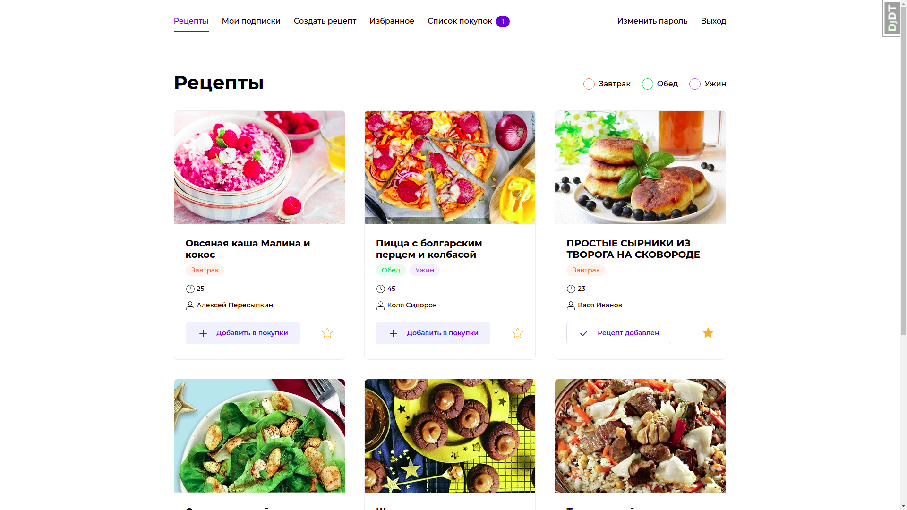

# foodgram (Продуктовый помощник)


### Описание

Сайт, на котором пользователи публикуют рецепты, добавляют чужие рецепты в избранное и подписываются на публикации других авторов. Сервис «Список покупок» позволяет пользователям создавать список продуктов, которые нужно купить для приготовления выбранных блюд.

### Технологии

Python 3.8  
Django 4.0  
Docker  
djangorestframework     
Nginx   
Gunicorn    

### Запуск проекта с помощью Docker-compose

- Склонируйте репозиторий:

```
git clone https://github.com/AlexeyPeresypkin/foodgram.git
```

- Добавьте в корневую директорию файл `.env` с переменными окружения для работы с базой данных:

```
POSTGRES_DB=foodgram # имя базы данных
POSTGRES_USER=postgres # логин для подключения к базе данных
POSTGRES_PASSWORD=postgres # пароль для подключения к БД (установите свой)
DB_HOST=db # название сервиса (контейнера)
DB_PORT=5432 # порт для подключения к БД 
```

- Запустите docker-compose командой `sudo docker-compose up -d` 
- Войдите в запущенный контейнер `docker exec -it <CONTAINER ID> bash`
- Соберите статику командой `./manage.py collectstatic`
- Создайте таблицы БД `./manage.py makemigrations`
- Накатите миграции `./manage.py migrate`
- По необходимости заполняем БД данными следующими командами:
```
>>> python3 manage.py shell  
>>> from django.contrib.contenttypes.models import ContentType
>>> ContentType.objects.all().delete()
>>> quit()

python manage.py loaddata data.json 
```


